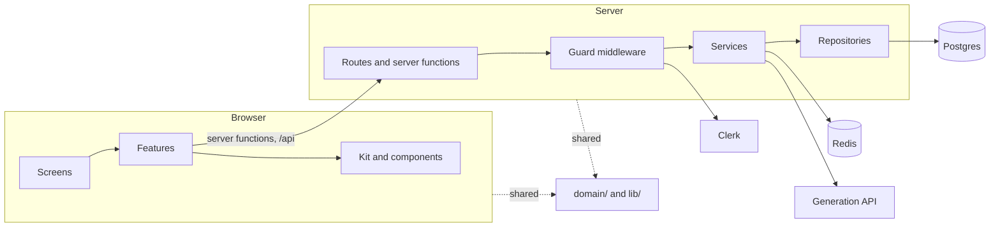
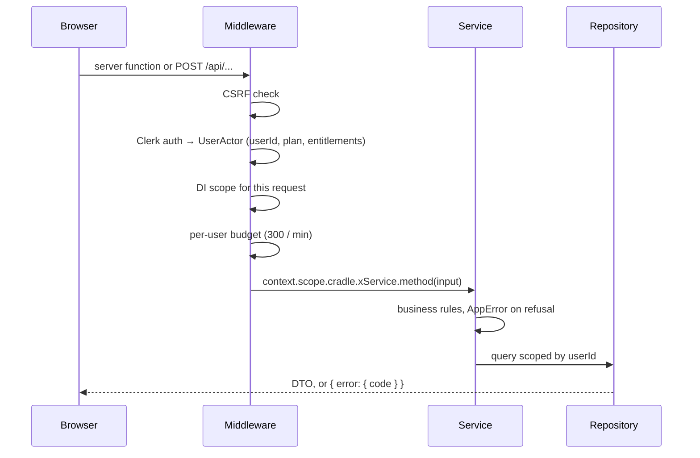
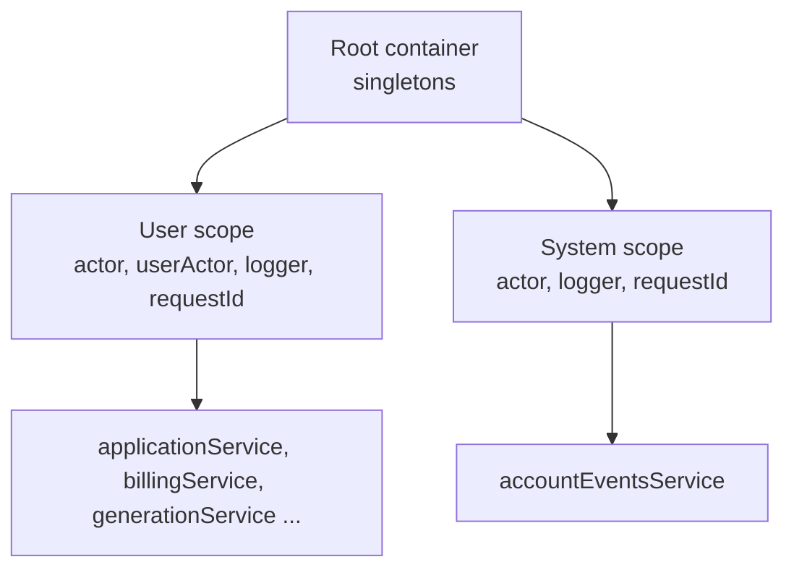
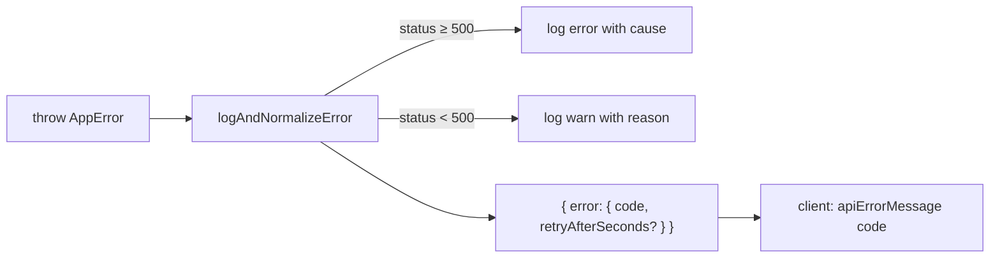

# Architecture

Alt+Shift is one TanStack Start application: a React client and a Node server in the same repository and the same deploy. This document explains how the pieces fit and why. For where files live, see [project-structure.md](project-structure.md).

## The big picture



Two runtimes, one language, one type system. The browser and the server share the pure code in `domain/` and `lib/`: zod schemas, plan limits, text helpers, the error contract. Everything else lives on exactly one side.

## Layers and the direction of imports

The top level of `src/` answers one question: where does this run?

| Folder | Runs in | Knows about |
| --- | --- | --- |
| `routes/` | both (SSR) | screens, server middleware |
| `client/` | browser | domain, lib, server middleware only |
| `server/` | Node | domain, lib |
| `domain/` | both | lib |
| `lib/` | both | nothing |

Inside `client/` there is a second ladder:

```
routes → screens → features → kit · components · lib
```

- A **screen** is one page. It composes features and owns the page-only UI.
- A **feature** is how the browser works with one domain: server functions, query factories, hooks, reusable UI.
- **Kit** is the design system. **Components** are shared pieces that know this product (logo, Clerk boundary, error pages). **Lib** is client infrastructure (query client, document head, generic hooks).

Two rules keep the ladder honest:

1. **Features never import each other.** A feature that must react to another one takes a callback, and the screen wires them together. Deleting a letter must refresh billing usage, so `useDeleteApplication({ onSettled })` gets `refreshUsage` from the dashboard screen, not from the billing feature.
2. **Screens never import each other.** Shared UI moves down into a feature, kit or components.

Biome enforces every arrow with `noRestrictedImports`, one override per layer in `biome.json`. An import in the wrong direction fails `npm run lint`.

## The client and server boundary

A leaked server module means a leaked secret, so the boundary is guarded three ways:

| Guard | What it does |
| --- | --- |
| `*.server.ts` suffix | marks server-only modules; the bundler refuses them in the client |
| Biome rule | `client/**` may not import a `.server` module or anything under `@/server` except `@/server/middleware/*` |
| Folder split | `client/` and `server/` are separate roots, so the question is visible in every path |

Server functions live in `client/features/*/api/*.api.ts`. Their bodies run on the server, but the client imports them to get the RPC stub, so they drop the suffix and reach services only through `context.scope.cradle`.

## A request, end to end



Server functions go through `userScopeMiddleware`. Cookie-authenticated API routes go through `userApiScopeMiddleware`, which adds the CSRF check that the global middleware applies only to server functions. Webhooks go through `systemApiScopeMiddleware` and authenticate by signature, not by session.

## Actors and dependency injection

The server uses awilix with a strict proxy container. Infrastructure is a singleton (config, Prisma, Redis, rate limiter, logger, the Generation API gateway). Every service and repository is **scoped**: a fresh instance per request, bound to that request's actor.



| Actor | Created by | Carries |
| --- | --- | --- |
| `UserActor` | Clerk session | `userId`, `plan`, `entitlements` |
| `SystemActor` | webhook route | `source: 'clerk-webhook'` |

A service gets the user from `userActor` in its cradle, never from an argument. `userActor` is registered only in user scopes, so a webhook handler cannot resolve a user service by accident: the strict container throws.

The plan and entitlements come from Clerk session claims via `has({ feature })`. The database never stores a plan.

## Ownership

**Every query is scoped by `userId` inside the repository.** The repository exposes helpers like `active(userId)` and every `where` starts from one of them. Services never load a row by id and then compare owners. An update is an `updateMany` with the owner in the `WHERE`, and "0 rows" becomes `not_found`.

## Errors

Errors are `AppError` instances with a code from `src/lib/api/api-error.ts`. The code is the whole contract: the client maps it to a sentence in `api-error-message.ts`, and the compiler fails the build when a code has no sentence.



| Class | Code | HTTP |
| --- | --- | --- |
| `ValidationError` | `invalid_request` | 400 |
| `UnauthorizedError` | `unauthorized` | 401 |
| `ForbiddenError`, `PlanRequiredError` | `forbidden`, `plan_required` | 403 |
| `NotFoundError` | `not_found` | 404 |
| `ConflictError` | `generation_in_progress`, `application_limit_reached` | 409 |
| `PayloadTooLargeError` | `payload_too_large` | 413 |
| `RateLimitError` | `rate_limited`, `quota_exceeded` | 429 |
| `UpstreamError` | `unavailable`, `interrupted`, `rate_limited` | 502 or 429 |
| `NotConfiguredError` | `unavailable` | 503 |
| anything else | `internal` | 500 |

Only the payload crosses the wire. Messages and causes stay in the logs. A zod failure inside `validateInput(schema)` becomes `invalid_request`; a bare schema would surface as a plain `Error` and therefore as `internal`.

For server functions, TanStack would answer a thrown error with HTTP 200. `toServerFnError` sets the real status and rethrows a fresh `Error` whose message is the JSON payload, because the RPC serializer copies only own properties.

## Budgets

Anything that costs money or a shared resource goes through a budget in `src/server/rate-limit/budgets.ts`. A budget is a key, a limit and a window in one place, so the code that charges it and the code that reports it hit the same Redis counter.

| Budget | Limit | Window | Key | On refusal |
| --- | --- | --- | --- | --- |
| `clientIp` | 600 | 1 min | client IP | `rate_limited` |
| `user` | 300 | 1 min | user | `rate_limited` |
| `system` | 300 | 1 min | source and IP | `rate_limited` |
| `generationsPerMinute` | 4 | 1 min | user | `rate_limited` |
| `dailyGenerations` | 10 or 100 by plan | 24 h | user | `quota_exceeded` |
| `generationApi` | 6 | 1 min | one bucket for the deploy | `rate_limited` |

Counters are keyed by budget name, not by limit, so an upgrade keeps what the user already spent. A refused attempt refunds its own point so retrying at the limit never pushes the reset away. When Redis is unreachable the limiter falls back to per-process memory.

## Configuration

Environment is parsed once, at boot, in `config.server.ts`. A new variable goes into that schema and into `.env.example` in the same change. Product limits (timeouts, token budget, plan quotas) are constants in code, not environment, because they are decisions, not deployment details.

## Streaming

Letter generation is the one long-lived request. The server proxies the Generation API and relays the letter to the browser as NDJSON with an explicit `done` event. The whole flow, including retries, timeouts and refunds, is in [generation-api.md](generation-api.md).

## What runs where at render time

| Route | SSR | Why |
| --- | --- | --- |
| `/` landing, `/sign-in` | full | public pages, first paint matters |
| `/app/**` | `data-only` | the auth guard runs on the server, the pages build from a per-user browser cache the server never sees |

The signed-in workspace mounts `ClerkProvider` below the document root so the landing never loads Clerk's script. The details of the browser cache are in [storage.md](storage.md).
