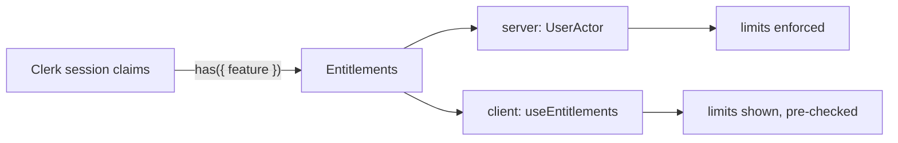
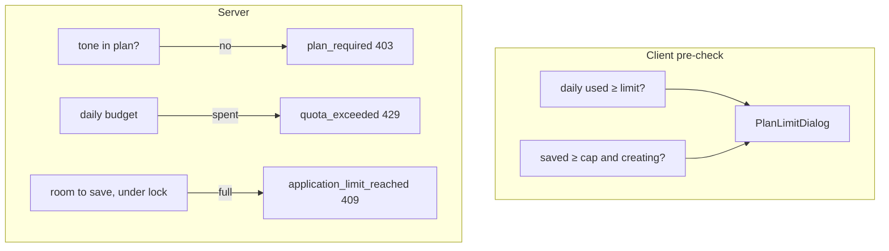

# Billing

Plans, limits and checkout run on Clerk Billing. The app stores no plan and no payment data. It reads **features** from the session and turns them into limits.

## Plans

| | Free | Pro |
| --- | --- | --- |
| Clerk plan slug | `free_user` | `pro` |
| letters per 24 h | 10 | 100 |
| saved applications | 5 | 500 |
| tones | professional | professional, warm, confident |
| price | free | set in Clerk, monthly or annual, optional trial |

Free keeps five applications on purpose: the goal and the ceiling are the same number, so a sixth letter needs Pro. The plan card, the usage meter and the limit dialog read the value from the entitlements, so their copy follows the constant.

## Features, not plan names

Access is checked by **feature**, never by plan name. Clerk attaches features to plans; the app only asks `has({ feature })`.

| Clerk feature | Entitlement |
| --- | --- |
| `extended_daily_quota` | `dailyGenerations`: 100 instead of 10 |
| `extended_history` | `maxApplications`: 500 instead of 5 |
| `letter_tones` | `letterTones`: true |

`subscriptionFrom(has)` in `domain/billing` builds `{ plan, entitlements }` from those three checks. A new plan in Clerk with the same features needs no code change.



## Where the plan is read

| Side | Source | Used for |
| --- | --- | --- |
| server | Clerk `auth()` in `authenticate.server.ts`, on every request | `UserActor.entitlements`, the only thing services trust |
| client | Clerk `useAuth().has` in `useEntitlements` | showing limits, disabling tones, pre-checking before a request |

Until Clerk has loaded, the client assumes Free. The server never assumes.

## Where limits are enforced

Every limit is enforced on the server. The client only pre-checks to avoid a request that would be refused.



| Limit | Mechanism | Refusal |
| --- | --- | --- |
| tones | `assertAllowed` before the upstream call | `plan_required` |
| daily letters | Redis budget `dailyGenerations`, 24 h window, points = entitlement | `quota_exceeded` with `Retry-After` |
| saved applications | count under a per-user advisory lock, checked before generating and again at save | `application_limit_reached` |

The daily counter is keyed by budget name, not by limit, so an upgrade mid-window keeps what was already spent and raises the ceiling.

Undo after delete goes through the same cap check, so restoring cannot exceed the plan.

## Usage overview

One server function, `getBillingOverview`, returns:

```
{ plan, entitlements, usage: { applications, generationsInWindow, generationsResetInSeconds } }
```

`applications` is a count. `generationsInWindow` and the reset time come from peeking the Redis budget, so the number the user sees is the number the limiter enforces. The query refetches itself one second after the window resets.

The header shows the goal progress until the goal is reached, then the daily letters ring. The billing page shows both meters and the reset countdown.

## Plan limit dialog

When a limit is hit, before or after a request, the client opens one dialog with a plain sentence: what the plan includes, when the quota resets in hours, and, on Free, what Pro would give. Its actions are "Got it" or "Not now" and "See plans". The countdown runs from the query's `dataUpdatedAt`, so a tab left open does not keep blocking after the window has reset.

## Checkout and management

The billing page lists plans from Clerk's `usePlans` and the current subscription from `useSubscription`. Prices, trial days and annual billing come from Clerk; the app formats money and matches plans to `PLAN_SLUGS`.

| Card | Action |
| --- | --- |
| Free | none |
| current paid plan | Clerk `<SubscriptionDetailsButton>`: manage or cancel |
| other paid plan | Clerk `<CheckoutButton>` for the chosen period, redirecting back to `/app/billing` |

No custom checkout or portal endpoint exists.

## Keeping the client in sync

Clerk refreshes the session after checkout. `useSyncPlanChanges` compares entitlements across renders and, when they change, the workspace shell refreshes usage and the goal stats. Features never call each other directly; the shell passes the callback.

## Webhooks

`POST /api/webhooks/clerk` is verified by signature with `CLERK_WEBHOOK_SIGNING_SECRET` and runs in a **system** scope: no session, no user services.

| Event | Action |
| --- | --- |
| `user.deleted` | hard-delete every application of that user |
| `subscription.*`, `subscriptionItem.*`, `paymentAttempt.*` | logged; `pastDue` and `incomplete` at `warn` as "Billing needs attention" |
| anything else | ignored at `debug` |

Billing events are logged, not stored, because entitlements come from the session anyway. If the secret is not configured the route answers 503 and Clerk retries later.
