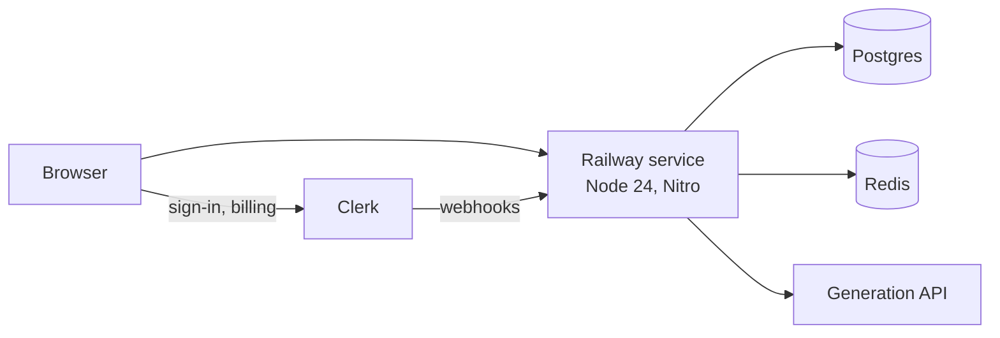
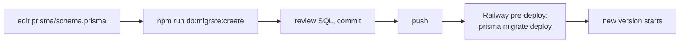
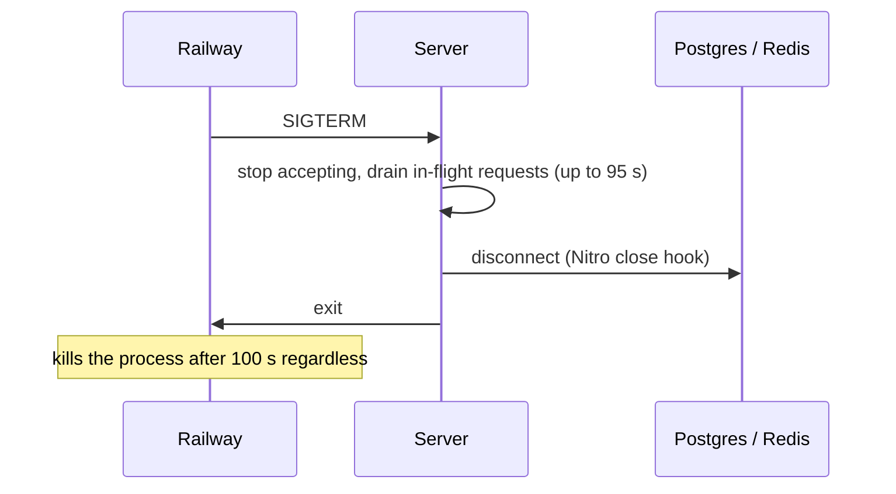

# Deployment

The app is one Node process on Railway with a managed Postgres and Redis next to it. Locally the same two databases run in Docker.

## Topology

| Piece | Local | Production |
| --- | --- | --- |
| App | `vite dev --port 3000` | `node .output/server/index.mjs` |
| Postgres | `postgres:17-alpine` in Docker, port 5435 | Railway Postgres |
| Redis | `redis:7-alpine` in Docker, port 6380, persistence off | Railway Redis |
| Migrations | applied by `npm run dev` before start | applied by Railway's pre-deploy step |

## Environment

Every variable is parsed once at boot in `src/server/config.server.ts`. A missing or malformed value crashes the process before it starts listening, so a bad deploy never serves a request.

| Variable | Required | Default | Used for |
| --- | --- | --- | --- |
| `DATABASE_URL` | yes | | Postgres connection |
| `REDIS_URL` | yes | | rate limits and the generation lock |
| `CLERK_SECRET_KEY` | yes | | server-side session checks |
| `VITE_CLERK_PUBLISHABLE_KEY` | yes | | Clerk in the browser (client bundle) |
| `GENERATION_API_TOKEN` | yes | | upstream auth, server only |
| `GENERATION_API_URL` | no | the assignment's endpoint | upstream URL |
| `CLERK_WEBHOOK_SIGNING_SECRET` | no | unset | verifying Clerk webhooks; without it the webhook route answers 503 |
| `DATABASE_POOL_MAX` | no | 10 | Postgres pool size, 1 to 100 |
| `NODE_ENV` | no | `development` | enables HSTS and production behaviour |

Product limits are code, not environment: daily letters per plan, saved letters per plan, timeouts, token budget. They live in `config.server.ts` and `src/domain/billing/billing-entitlements.ts`.

## Railway

`railway.json` describes the service:

| Setting | Value | Why |
| --- | --- | --- |
| builder | Railpack | default Node build, no Dockerfile |
| build | `npm run build` | `prisma generate && vite build` |
| pre-deploy | `npx prisma migrate deploy` | migrations run once per deploy, before the new version takes traffic |
| start | `npm run start` | `SERVER_SHUTDOWN_TIMEOUT=95 node --enable-source-maps .output/server/index.mjs` |
| draining | 100 s | long enough for a 90 s letter to finish |
| restart | on failure, 3 retries | |

Redis connects with `family: 0` because Railway's private network is IPv6-only.

Client IP is taken from the last entry of `x-forwarded-for`. Railway appends the real peer there, everything to the left is client-forgeable.

## Migrations

Rules:

- Migrations are created locally and committed. Production only ever runs `migrate deploy`.
- Never run `prisma migrate reset` or point any command at a non-local database without explicit approval.
- The single migration so far is `20260921100735_init`.

## Graceful shutdown

A deploy must not lose a letter that is being saved. Shutdown happens in this order:

- `SERVER_SHUTDOWN_TIMEOUT=95` is read by the HTTP server (srvx). It stops accepting connections, waits for in-flight requests, and force-closes after 95 s.
- Postgres and Redis are disconnected in Nitro's `close` hook, which runs after draining. Closing them on SIGTERM directly failed saves that were still in flight.
- 95 s sits under Railway's 100 s draining window, and a generation is capped at 90 s, so a letter that started before the deploy can finish.

## Startup checks

- The env schema is parsed in a Nitro plugin at startup and again when the container is built. A bad env fails fast.
- Prisma pool: connect timeout 5 s, statement timeout 10 s, idle timeout 30 s.
- Redis: connect timeout 2 s, no offline queue, one retry per command. When Redis is down, rate limits fall back to per-process memory and the generation lock is skipped. The lock saves money, not data.

## Static assets

Nitro serves the client build with Brotli and gzip precompressed. Cache headers are set per path in `vite.config.ts`:

| Path | Cache-Control |
| --- | --- |
| `/fonts/**` | `public, max-age=31536000, immutable` |
| favicon, icons, `manifest.json` | `public, max-age=86400` |

## Logs

Structured JSON through pino, level `info`, service name `alt-shift`. Every line carries `requestId` (Railway's `x-railway-request-id` when present) and `clientIp`, and user-scoped lines carry `userId`. Authorization headers, cookies and tokens are redacted. 4xx refusals are logged at `warn`, 5xx failures at `error` with the cause.
