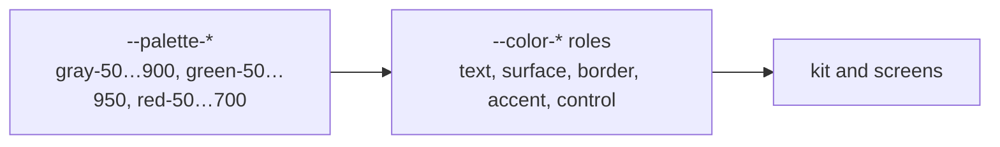

# Design system

CSS Modules, design tokens and a flat kit of 30 components in `src/client/kit/`. No Tailwind, no UI library: the mockups have their own language and the kit is smaller than a mapping layer would be.

## Tokens

`src/client/styles/tokens.css` has two layers. Components read only the second.



| Group | Examples |
| --- | --- |
| text | `--color-text-primary`, `-secondary`, `-tertiary`, `-label`, `-disabled`, `-on-accent`, `-danger` |
| surface | `--color-surface-page`, `-muted`, `-hover`, `-success`, `-danger`, `--color-skeleton` |
| border | `--color-border-default`, `-subtle`, `-hairline`, `-focus`, `-danger` |
| accent | `--color-accent`, `-hover`, `-active`, `-subtle`, `--color-danger` |
| controls | `--color-control-hover`, `-disabled`, `--color-progress-done`, `-todo`, `--color-meter-fill` |
| inverse and ink | `--color-surface-inverse`, `--color-text-on-inverse`, `--gradient-ink`, `--color-mesh-1..3` |
| type | `--type-body-xs|sm|md|lg`, `--type-prose-*`, `--type-display-sm|md|lg|xl`, used as `font:` |
| space | `--space-1` … `--space-40`, 0.25 rem steps |
| radius | `--radius-sm|md|lg|xl|2xl|3xl|full` |
| icons | `--icon-sm|md|lg`; a component sets `--icon-size` and Lucide reads it |
| motion | `--duration-fast|base|slow|emphasized`, `--ease-out`, `--ease-emphasized` |
| elevation | `--shadow-xs|card|card-hover|raised|floating|toast` |
| layout | `--layout-max-width: 70rem`, `--layout-gutter`, `--control-height-xs|sm|md|lg` |

Rules: colour roles, never palette values or literals; `font: var(--type-body-sm)` for text, never separate size and line height; `--space-*` for every gap and padding. Changing the theme is re-pointing roles in one file.

Fonts are Fixel Text (400, 500, 600) and Fixel Display (600), self-hosted as woff2, preloaded in `<head>`.

## Cascade layers

Every CSS module is one `@layer` block named after its folder.

```
@layer reset, tokens, base, kit, components, features, screens, utilities;
```

Later layers win regardless of specificity, so a `className` passed from a screen into a kit component always beats the component's own rules. No `!important`, no specificity fights. `.visually-hidden` sits in `utilities` above everything.

## Module conventions

```css
@layer kit {
	.root {
		--_height: var(--control-height-sm);
		block-size: var(--_height);
	}
	.primary { background: var(--color-accent); }
	.md { --_height: var(--control-height-md); }
	@media (width < 40rem) { … }
}
```

| Rule | Why |
| --- | --- |
| `.root` is the outer element, parts and variants are camelCase roles | one vocabulary in every module |
| variants are mapped in TSX with an explicit lookup, `TONE_CLASS[tone]`, never `styles[tone]` | the compiler and the linter can see every class is used and exists |
| internal knobs are `--_` custom properties set by variant classes | a size class changes three numbers, not three rules |
| nesting for states, context and media queries | |
| media queries are only `(width < x)` or `(width >= x)` with x in 30, 40, 48, 60, 64 rem | five breakpoints, no in-betweens |
| `prefers-reduced-motion` and `forced-colors` are handled where they matter | one global rule kills animation; hover lifts are neutralised per component |
| CSS has no comments | |

A component never styles through another component's module. It takes a prop or has its own stylesheet.

## The kit

| Package | Role |
| --- | --- |
| `button`, `button-link` | variants primary, secondary, danger, ghost; sizes sm, md, lg; pill shape; never disables while loading, it sets `aria-busy` and swallows the click |
| `icon-button-link`, `text-link` | router links via `createLink` |
| `heading`, `eyebrow`, `highlight`, `badge` | text |
| `panel` | the one container shape: rounded, borderless, tones muted, success, raised; `interactive` lifts on hover |
| `field`, `input`, `text-area` | `Field` owns the id, label and description; controls read them from context so label and input cannot drift |
| `form/` | TanStack Form binding: `useAppForm`, `withForm`, `TextField`, `TextAreaField`, `SegmentedField` |
| `search-field`, `segmented-control`, `character-count` | inputs |
| `dialog`, `confirm-dialog` | native `<dialog>` with `showModal()`; confirm is a react-call callable and puts Cancel first so Enter never confirms a destructive question |
| `toast` | one toast at a time, auto-dismiss after 6 s but never while hovered or focused, restores focus on dismiss |
| `alert`, `load-error`, `skeleton`, `spinner` | states |
| `meter`, `meter-value`, `progress-ring`, `step-progress` | progress; `step-progress` renders dots or bars from one component |
| `container`, `page-header`, `status-page`, `standalone-page`, `header-status` | page layout |

## Patterns taken from the mockups

- **One container shape.** A rounded panel without a border, differing only by tone: grey for content (cards, the letter), green for motivation (the goal banner). That is `Panel`.
- **Three button variants and two sizes** (40 and 56 px). `ButtonLink` is the same button as a router link.
- **Progress in two shapes**, dots in the header and bars in the banner. One `StepProgress` with a `variant`.
- **Fields** bind label, description and `aria-invalid` to the control through context.

## Forms

TanStack Form with one zod schema from `domain/` as both `onMount` and `onChange` validator, so submit starts disabled and the same schema parses the values in `onSubmit`. Fields are `form.AppField` plus a field component. A field turns red only after the user has touched it. A new kind of control becomes a field component in `kit/form`, not local state.

## Dialogs

Dialogs are callables: `const ok = await ConfirmDialog.call({ title, confirmLabel })`. The caller has no open state. Every callable's `.Root` is mounted once in the workspace's `dialog-roots`.

## Responsive behaviour

| Width | Change |
| --- | --- |
| < 60 rem | the editor's two columns stack; pressing Generate scrolls the letter panel into view |
| < 40 rem | the header keeps only the progress dots, the "3/5 applications generated" label becomes screen-reader text; the daily letters counter hides |
| < 30 rem | tighter paddings for 320 px phones |

## Accessibility defaults

- `:focus-visible` gets one ring, `--focus-ring`, everywhere, including Clerk's controls.
- Progress components expose `role="progressbar"` or a hidden native `<meter>`.
- Live regions announce copy results and the character-count overflow, but not every keystroke.
- View transitions and animations stop under `prefers-reduced-motion`.
