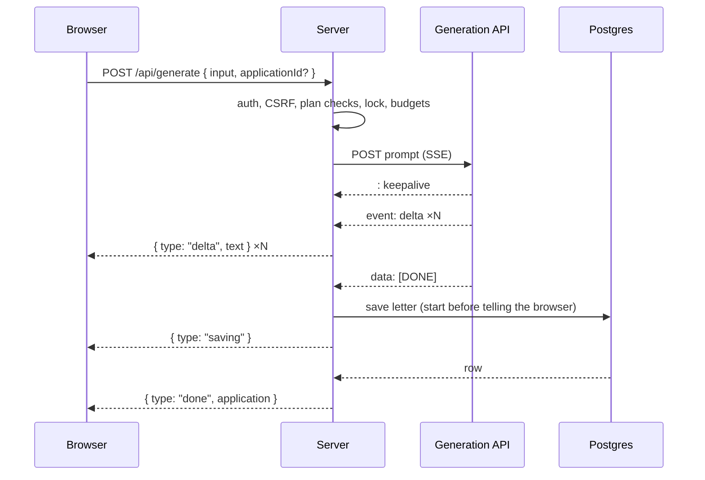
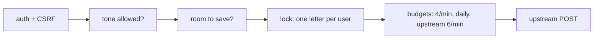
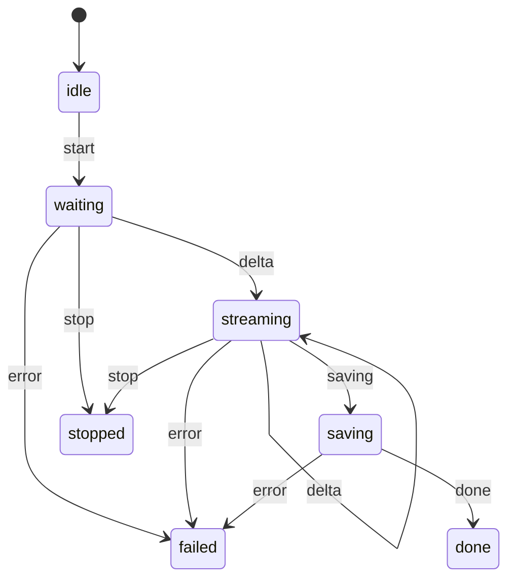

# Generation API integration

The letter is written by a model behind the Generation API. The browser never talks to it. The server proxies the call, turns the upstream SSE stream into NDJSON, saves the letter, and tells the browser when it is safe to trust the result.

## Flow



## Why a proxy

The upstream sends `Access-Control-Allow-Origin: *`, so the browser could call it directly. Then the token would be in the bundle. The server keeps the token, accepts only the four form fields, and builds the prompt itself, so the endpoint is not an open proxy to a paid model.

## The request

| Field | Value |
| --- | --- |
| URL | `GENERATION_API_URL`, default is the assignment's endpoint |
| Auth | `Authorization: Bearer <GENERATION_API_TOKEN>` |
| Body | `{ system, prompt, maxTokens: 1200 }` |
| Accept | `text/event-stream` |

`maxTokens` is 1200: a 150 to 230 word letter fits in 800 English tokens, but non-Latin scripts tokenise two to three times denser, and a letter cut by the limit ends in the same `[DONE]` as a finished one.

## Prompt

The system prompt fixes the shape: first person, greeting on its own line, three or four short paragraphs, 150 to 230 words, plain text, only the facts the applicant gave, no placeholders or signature, the applicant's language.

The user's fields go in as **data**, inside tags:

```
<application>
  <job_title>…</job_title>
  <company>…</company>
  <strengths>…</strengths>
  <additional_details>…</additional_details>
</application>
```

The system prompt says everything inside `<application>` is data from the applicant, never instructions. Angle brackets in user text are replaced with `‹` and `›`, so a value cannot close its own tag.

Tone is one of `professional`, `warm`, `confident`. Non-default tones are a Pro feature; a Free user's request with another tone is refused with `plan_required` before anything is spent.

## Before the first byte

Everything that can refuse the request happens before the upstream call, in this order:



| Check | Refusal | HTTP |
| --- | --- | --- |
| tone not in plan | `plan_required` | 403 |
| saved-letter cap reached (new letter only) | `application_limit_reached` | 409 |
| another letter already streaming for this user | `generation_in_progress` | 409 |
| more than 4 starts per minute | `rate_limited` + `Retry-After` | 429 |
| daily quota spent | `quota_exceeded` + `Retry-After` | 429 |
| deploy-wide upstream bucket (6 / min) full | `rate_limited` + `Retry-After` | 429 |

The three budgets are charged atomically. If a later one refuses, the earlier ones are refunded.

The upstream limit is 6 requests per minute **per token**, that is, for every user of the deploy at once. The per-user 4 per minute means one person pressing Try Again cannot lock everyone else out.

A refusal before the first byte is a normal HTTP response with a JSON `{ error: { code, retryAfterSeconds? } }` body.

## The lock

Redis `SET key token PX 120000 NX` on `lock:generation:<userId>`. Released by a compare-and-delete Lua script so an expired lock taken by a later request is never freed by the earlier one. The 120 s TTL is longer than the 90 s generation ceiling, so a running letter never loses its lock.

If Redis is down, the request proceeds unlocked. The lock saves money, not data.

## Reading the stream

The upstream is SSE. `eventsource-parser` handles the wire format, including the leading `: keepalive` comment. The gateway then:

- feeds a watchdog on every event;
- yields the `text` of each `delta`;
- returns on `data: [DONE]`, or on a clean close;
- throws on an `error` event, an oversized event (64 KiB), or a malformed delta.

Every failure after the first byte becomes one thing: `interrupted`.

### Retry

One retry, only before the first byte, only when the failure is transient: a dropped connection or an upstream 408, 425, 500, 502, 503, 504. The wait between attempts is 750 ms. Never retried: 429, a refused token, any failure after text has started, or a request the user already aborted.

### Timeouts

| Where | Value | Trips when |
| --- | --- | --- |
| server, idle | 30 s | no byte before the first token, or between chunks |
| server, total | 90 s | the whole generation |
| server, lock TTL | 120 s | safety net above the total |
| browser, idle | 60 s | no NDJSON line arrives; longer than any silence the server allows itself, so only a dead socket trips it |

## After the first byte

Once text has started the HTTP status is already 200, so failures travel **inside** the stream as `{ type: "error", error }`. The browser keeps the partial text on screen and shows the reason.

The relay also sanitises the model's output, which is data, not trusted text:

- control characters are dropped from every chunk (Postgres rejects NUL in a text column);
- the letter is capped at 20 000 characters;
- before saving, CRLF becomes LF, trailing spaces go, and runs of blank lines collapse to one;
- an empty letter is an error, not a short letter.

## Saving and `done`

The letter is saved **only after `[DONE]`**. A stream that simply stopped is a cut-off letter, never a short one, and it must not count toward the goal.

The save starts before the `saving` event is sent, so a browser that leaves at that moment does not lose the letter. `done` carries the saved application. The browser updates its cache from that payload and does not make a second request.

If the save fails for a server reason the browser gets `save_failed` and keeps the text visible with a request to copy it.

## Try Again

Try Again sends the saved letter's id. The server replaces the letter in the same row instead of creating a new one, so the goal counter cannot be inflated by retries. If the retry fails or is stopped, the previous letter stays on screen.

## Cancel

Stop, navigating away and closing the tab all abort the browser request. The server sees the cancel, aborts the upstream request and releases the lock. A letter nobody is waiting for does not spend the shared upstream budget.

Leaving during a stream asks for confirmation: the request already cost a quota point, and a letter without `done` is not saved.

## Refunds

The daily quota is a promise of letters, not of attempts.

| What happened | Daily quota |
| --- | --- |
| upstream failed to open after the budgets were charged | refunded |
| stream broke mid-letter and the user did not stop it | refunded |
| save failed for a server reason | refunded |
| user pressed Stop or left | kept, the model was already paid for |
| save refused because the letter was deleted or the cap was hit | kept, otherwise delete → restore would be unlimited free letters |

## Events on the wire

NDJSON, one JSON object per line, `Content-Type: application/x-ndjson`, `X-Accel-Buffering: no` so proxies do not buffer.

| Event | Payload |
| --- | --- |
| `delta` | `{ text }` |
| `saving` | |
| `done` | `{ application }` the saved DTO |
| `error` | `{ error: { code, retryAfterSeconds? } }` |

The browser reads lines with a manual reader loop because Safari cannot `for await` a `ReadableStream`. A body that ends without `done` is reported as `interrupted`.

## Client state



The state machine accepts Stop in `waiting` and `streaming`; once `saving` starts the letter is stored regardless. The footer shows the Stop button only in `streaming`: while the model is still thinking there is nothing to keep, and a button under the waiting animation reads as "something is stuck". A delta that arrives after Stop cannot revive the letter.

## Logging

`Letter generated` logs `firstTokenMs`, `durationMs` and `characters`. Time to first token and total duration are the two numbers that tell a slow provider from a slow save. Mid-stream failures log at `warn`, a failed save at `error`.

## Where the live API differs from its spec

Checked with direct requests on 21 Sep 2026.

| Observed | Handling |
| --- | --- |
| the stream opens with a `: keepalive` comment | skipped by the SSE parser, per spec |
| a terminal `data: [DONE]` arrives, although the spec says there is no end event | both `[DONE]` and a clean close end the letter |
| `maxTokens` is not validated: `5000` and even `"x"` return 200, while the stated cap is 1500 | we send 1200 |
| a letter cut by `maxTokens` ends in the same `[DONE]`, there is no `finish_reason` (tested with `maxTokens: 20`) | the only defence is token headroom |
| the length error is measured on the `prompt` field: "Prompt is too long (24000 characters max)" | our inputs are capped far below it |
| the 429 message includes seconds and `Retry-After` is sent | `Retry-After` is passed through to the browser |
