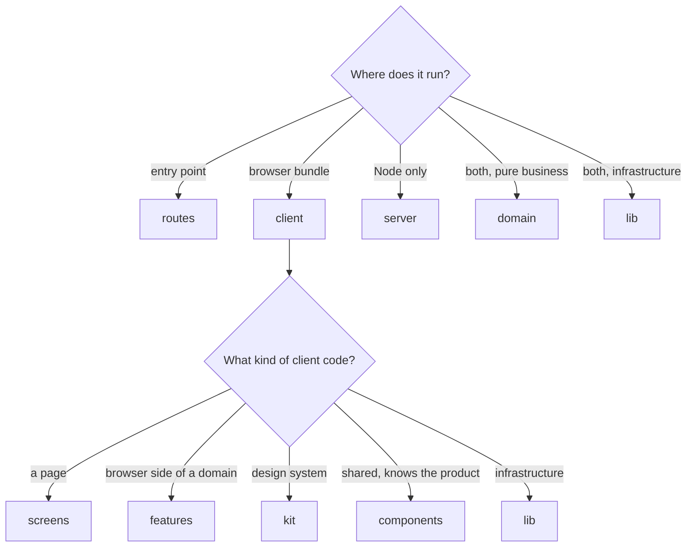
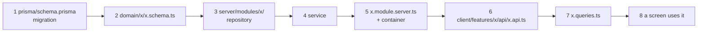

# Project structure

This document is the map of `src/`: what each folder is for, how the folders relate, and where a new file goes. The reasoning behind the layers is in [architecture.md](architecture.md).

## How the tree works

The tree has two levels of questions.



**Level one is the runtime.** `client/`, `server/`, `domain/` and `lib/` are the four roots, plus `routes/` as the framework's entry points. The most dangerous mistake in a full-stack framework is server code reaching the browser bundle, so that question comes first and is visible in every import path.

**Level two is the kind of code**, and it exists only inside `client/`, because the client is 80 percent of the files. The server is small enough to be organised by domain module plus infrastructure.

Imports flow down the tree, never up or sideways between siblings of the same kind. Biome checks it.

## The tree

```
src/
  routes/                thin route files: URL, guards, head() → a screen
  client/                everything that reaches the browser bundle
    screens/<page>/      one page each: composes features, owns page-only UI
    features/<domain>/   the browser side of one domain
      api/               server functions, query keys and factories, cache helpers
      hooks/             client hooks
      ui/                the domain's reusable components
    kit/                 the design system, flat: button, field, dialog, toast, form/ ...
    components/          shared pieces that know this product: logo, clerk-boundary, error pages
    lib/                 client infrastructure: query/, document/, hooks/
    styles/              tokens, reset, base, fonts, cascade layers
  server/                everything that runs only on the server
    modules/<domain>/    repository, service, mapper, DI module
    <infra>/             config, auth, di, errors, middleware, http, database, redis,
                         rate-limit, gateways, webhooks, observability, lifecycle
  domain/<domain>/       pure code both sides share: zod schemas, constants, plain logic
  lib/                   infrastructure both sides share: api/ (error contract, NDJSON), text/
  router.tsx  start.ts  routeTree.gen.ts (generated)
```

## Each folder, and why it exists

### `routes/`

TanStack Router's file-based routes. A route file holds only URL concerns: params, search validation, `beforeLoad` guards, `head()`, `ssr`. It renders a screen and nothing else, so a route is never where behaviour lives. Route files keep TanStack's naming (`$applicationId.tsx`, `sign-in.$.tsx`), the one place kebab-case is not enforced.

```
routes/
  __root.tsx                  document shell, head, error and not-found fallbacks
  index.tsx                   /            landing
  sign-in.$.tsx               /sign-in     Clerk sign-in and sign-up
  app/route.tsx               /app         auth guard, ssr: 'data-only', workspace shell
  app/index.tsx               /app         → /app/applications
  app/applications/index.tsx  /app/applications           dashboard, ?q= search
  app/applications/create.tsx /app/applications/create    new letter
  app/applications/$applicationId.tsx                     saved letter
  app/billing.tsx             /app/billing
  api/generate.ts             POST /api/generate          the letter stream
  api/webhooks/clerk.ts       POST /api/webhooks/clerk
```

### `client/screens/`

One folder per page. A screen composes features and holds the UI that only this page needs. Screens do not import each other: if two pages need the same piece, it moves down to a feature, kit or components.

| Screen | Page |
| --- | --- |
| `landing` | marketing page, sections, scroll reveal |
| `auth` | sign-in and sign-up on one page |
| `workspace` | the `/app` shell: Clerk boundary, per-user query client, header, dialog roots |
| `dashboard` | list of saved letters, search, empty state |
| `application` | the editor: form, streaming letter panel |
| `billing` | usage and plan cards |

### `client/features/`

The browser side of one domain, in three segments. `api/` holds the server functions (`*.api.ts`), the query keys and factories (`*.queries.ts`) and the optimistic cache helpers (`*.cache.ts`). `hooks/` holds behaviour. `ui/` holds components that more than one screen uses.

Features never import each other. They take callbacks and the screen wires them. This keeps every feature deletable on its own.

`marketing` is the odd one: it has only `ui/` with the landing copy and icons, shared by the landing and the sign-in page.

### `client/kit/`

The design system, flat. Every package is a folder with the component, its CSS module and an `index.ts`. Nothing in `kit/` knows this product: no brand, no copy, no URLs. It could move to the next project unchanged. `form/` is the TanStack Form binding and its field components; it is the one package with sub-folders.

### `client/components/`

Shared pieces that know this product but no domain: `logo`, `home-link`, `clerk-boundary`, `not-found`, `route-error`, `route-cold-start`. Six packages, flat.

The line between `kit/` and `components/`: would you copy it to another product as is? Yes → kit. No, but several screens need it → components. Only one screen needs it → that screen's folder.

### `client/lib/`

Client infrastructure, one folder per concern: `query/` (the per-user persisted query client), `document/` (brand name, page titles, `<head>`, view transitions), `hooks/` (generic React hooks). Knows no domain.

### `client/styles/`

Global CSS: the cascade layer order, tokens, reset, base, fonts, utilities. See [design-system.md](design-system.md).

### `server/`

`modules/<domain>/` is a domain's server side: the repository (Prisma, every query scoped by owner), the service (rules, errors, logging), a mapper to DTOs, and the DI module that registers them. Everything else under `server/` is infrastructure and has no domain knowledge.

```
server/
  modules/applications/   repository, service, maintenance service, mapper, module
  modules/billing/        overview service, webhook events
  modules/generation/     generation service, prompt, letter relay
  modules/account/        Clerk webhook events → the services above
  auth/                   actor types, Clerk authentication
  config.server.ts        env schema and product constants, parsed once
  di/                     awilix container, core module, request scopes
  middleware/             user scope, API scope, CSRF, guards, validateInput
  errors/                 AppError classes, response mapping, logging
  http/                   request context, body limits, NDJSON, security headers
  database/               Prisma client, advisory lock
  redis/                  client, distributed lock
  rate-limit/             budgets, limiter
  gateways/generation-api/  the upstream client: connection, stream, watchdog
  webhooks/               Clerk signature verification
  observability/          pino logger
  lifecycle/              graceful shutdown
  entry.ts                the server entry
```

### `domain/`

Pure code both sides need, one folder per domain. `<x>.schema.ts` holds zod schemas and their inferred types, nothing else. `<x>-<concept>.ts` holds one concept each: constants, plain types, pure functions (`application-tone`, `billing-plans`, `generation-state`). No React, no Node, no I/O.

### `lib/`

Infrastructure both sides need: `api/` is the contract with our own server (error codes, error messages, the NDJSON reader), `text/` is pure string helpers. `lib/` imports nothing from the project.

## Naming and file rules

| Rule | Example |
| --- | --- |
| kebab-case files and folders | `use-plan-limits.ts`, `plan-card/` |
| `*.server.ts` is server-only | `application.service.server.ts` |
| server functions and middleware drop the suffix | `application.api.ts`, `user-scope.middleware.ts` |
| one component per file, in its own folder with its CSS module | `plan-card/plan-card.tsx` + `plan-card.module.css` |
| a folder's `index.ts` re-exports only what it offers others | `export * from './button'` |
| no barrels in `domain/`, `features/`, `screens/` | import `@/client/features/billing/hooks/use-entitlements`, not a folder |
| route-private files start with `-` | `-sign-in.module.css` |
| imports inside one module are relative, across modules `@/` | `./application-tone` vs `@/domain/applications/application-tone` |

Why no barrels: a `features/billing/index.ts` would mix server functions, hooks and styled UI, and importing one name drags in the rest. It once put the whole landing into every page's entry chunk.

## Where a new file goes

| The file is | It goes to |
| --- | --- |
| a route or URL concern | `routes/` |
| a page | `client/screens/<page>/` |
| a server function, query factory or cache helper | `client/features/<domain>/api/` |
| a hook that talks to one domain | `client/features/<domain>/hooks/` |
| a component two screens share and it knows a domain | `client/features/<domain>/ui/` |
| a component that could ship in any product | `client/kit/` |
| a component that knows the brand or product copy | `client/components/` |
| a generic hook or client infrastructure | `client/lib/` |
| a repository, service or mapper | `server/modules/<domain>/` |
| server infrastructure | `server/<concern>/` |
| a zod schema or pure rule both sides need | `domain/<domain>/` |
| a pure helper both sides need, no domain | `lib/<concern>/` |

## Adding a server feature, step by step



1. Model in `prisma/schema.prisma`, then `npm run db:migrate:create`.
2. `domain/x/x.schema.ts`: the zod schemas both sides share. Limits and other types go to `domain/x/x-<concept>.ts`.
3. `server/modules/x/x.repository.server.ts`: Prisma only, owner-scoped.
4. `server/modules/x/x.service.server.ts`: rules, `AppError`s, logging.
5. Register both in `x.module.server.ts` with `.scoped()` and add the module to `server/di/container.server.ts`.
6. `client/features/x/api/x.api.ts`: `createServerFn` + `userScopeMiddleware` + `validateInput(schema)` + one service call.
7. `client/features/x/api/x.queries.ts`: key and query factories.
8. A screen composes it.
