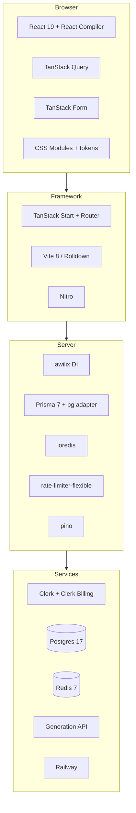

# Stack

What the app is built with and why each piece was chosen. Versions are the ones in `package.json` at the time of writing.

## At a glance

## Runtime

| Piece | Version | Why |
| --- | --- | --- |
| Node | ≥ 24 | native `fetch`, `AbortSignal.any`, `process.loadEnvFile`; nothing polyfilled |
| TypeScript | 6 | `strict`, `noUncheckedIndexedAccess`, `verbatimModuleSyntax` |
| React | 19.3 | `<ViewTransition>`, `useEffectEvent`, ref as prop |
| React Compiler | 1.0 | auto-memoisation through `@rolldown/plugin-babel`, so components carry no `useMemo` noise |

## Framework

| Piece | Version | Why |
| --- | --- | --- |
| TanStack Start | 1.168.25 | file routes, server functions with typed middleware, SSR on Nitro. One codebase, one deploy, no separate API server |
| TanStack Router | 1.170.15 | typed params and search, `beforeLoad` guards, view transitions, `createLink` |
| Vite | 8 (Rolldown) | dev server and build |
| Nitro | 3 | the production server: presets, route rules, graceful `close` hook |

Start and Router are pinned to exact versions, everything else takes minor updates. Upgrade the two together and on purpose: they move fast and their releases are coupled.

## Browser data

| Piece | Why |
| --- | --- |
| TanStack Query 5 | server state in the browser; a per-user client whose snapshot lives in `localStorage`, so the dashboard renders before the first request. See [storage.md](storage.md) |
| TanStack Form 1 | one zod schema drives the form, the server and the database; `useAppForm` and `withForm` bind fields to kit controls |
| zod 4 | the single contract for inputs, DTOs, stream events, env and the cache snapshot |
| react-call | dialogs as callables: `await ConfirmDialog.call({...})`, no open state in the caller |
| lucide-react | icons, sized through `--icon-size` |

## Styling

| Piece | Why |
| --- | --- |
| CSS Modules | scoped classes, zero runtime, one `@layer` block per module |
| Design tokens | palette → semantic roles in `tokens.css`; components read roles only |
| Cascade layers | `reset, tokens, base, kit, components, features, screens, utilities`: a `className` from above always beats the component's own rules |
| Fixel | self-hosted woff2, preloaded, no font CDN |

No Tailwind and no UI kit: the mockups have their own visual language, and a 30-package kit is smaller than the mapping layer would be. See [design-system.md](design-system.md).

## Server

| Piece | Why |
| --- | --- |
| awilix | DI with request scopes. A service is bound to the request's user, and a webhook scope cannot resolve a user service by mistake |
| Prisma 7 + `@prisma/adapter-pg` | typed queries over a plain `pg` pool with explicit timeouts; the client is generated into `src/generated`, not committed |
| ioredis | rate-limit counters and the one-generation-per-user lock |
| rate-limiter-flexible | Redis counters with a memory fallback; every budget is one constructor in `budgets.ts` |
| eventsource-parser | spec-compliant SSE parsing of the upstream stream |
| pino | structured JSON logs with redaction |

## Services

| Service | Role |
| --- | --- |
| Clerk | authentication, session claims, webhooks |
| Clerk Billing | plans, features and checkout. Entitlements are read from `has({ feature })`, so the app never stores a plan |
| Postgres 17 | the letters. Source of truth |
| Redis 7 | rate limits and locks. Loses nothing important if it disappears |
| Generation API | the model behind the letters, reached only from the server |
| Railway | build, deploy, Postgres and Redis. See [deployment.md](deployment.md) |

## Tooling

| Tool | Role |
| --- | --- |
| Biome 2.4 | formatter and linter in one: tabs, 120 columns, single quotes, no semicolons, sorted keys, attributes and CSS properties, and the import-layering rules |
| Docker Compose | local Postgres and Redis, started by `npm run dev` |
| Prisma Migrate | migrations created locally, applied by Railway's pre-deploy step |

There are no automated tests. `npm run lint` and `npm run typecheck` are the gate.

## Commands

| Command | What it does |
| --- | --- |
| `npm run dev` | starts Postgres and Redis in Docker, applies migrations, serves on :3000 |
| `npm run build` | `prisma generate` + `vite build` into `.output/` |
| `npm start` | runs the built server |
| `npm run lint` / `lint:fix` | Biome check, or check and write |
| `npm run typecheck` | `tsc --noEmit` |
| `npm run db:migrate:create` | create a migration from schema changes |
| `npm run db:migrate` | create and apply locally |
| `npm run db:studio` | Prisma Studio |
| `npm run db:down` | stop the local databases |
