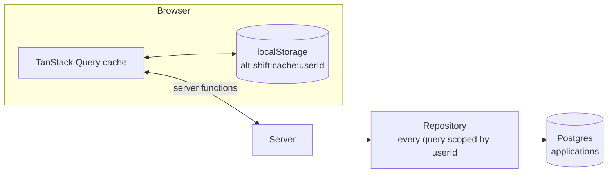
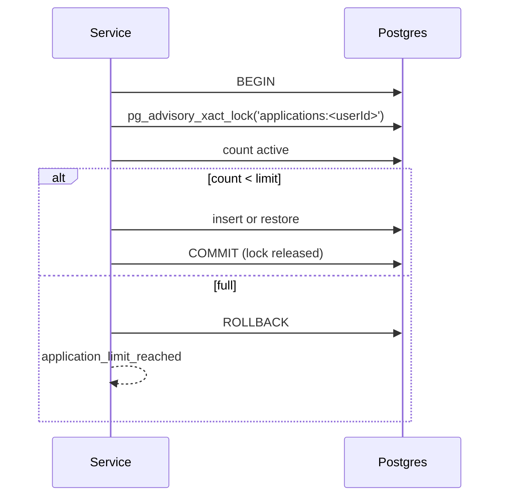

# Storage

Letters live in two places: Postgres is the source of truth, and each user's browser keeps a snapshot of their list so the dashboard renders before the first request.

## The table

One table, `applications`.

| Column | Type | Note |
| --- | --- | --- |
| `id` | uuid v7 | time-ordered, so it is sort key, cursor and index in one |
| `user_id` | text | Clerk user id, owner |
| `job_title`, `company` | varchar(100) | |
| `skills` | varchar(300) | |
| `details` | varchar(1200) | |
| `tone` | varchar(20) | default `professional` |
| `letter` | text | |
| `created_at`, `updated_at` | timestamptz | |
| `deleted_at` | timestamptz, null | soft delete |

Index: `(user_id, deleted_at, id desc)`, which serves the list, the count and the cursor.

The same limits are the zod schema in `domain/applications`, so the form, the server and the column agree.

## Ownership

Every repository method takes `userId` and starts its `where` from `active(userId)` or `owned(userId)`. There is no `findById`. An update is `updateMany` with the owner in the `where`; zero rows means `not_found`. A service can therefore never load someone else's row and forget to check.

## Soft delete and Undo

Delete sets `deleted_at`. The toast offers Undo, which clears it and puts the card back where it was. Restore goes through the saved-letter cap, so Undo can be refused with `application_limit_reached`. When Clerk reports `user.deleted`, every row of that user is hard-deleted.

## The saved-letter cap

The plan limits how many active applications a user keeps. The check and the write run in one transaction under a per-user Postgres advisory lock:

Two letters generated in parallel cannot both take the last slot. The lock is transaction-scoped, so a crash releases it.

## Listing and search

Keyset pagination, 10 per page, `id < cursor` ordered by `id desc`. No offsets, no ties, and the index covers it.

Search is up to 6 lowercase terms; every term must appear in the job title, the company or the letter, case-insensitive. The letter is searched because the card shows only the letter. `%`, `_` and `\` in the user's input are escaped, because Prisma's `contains` does not escape them and a bare `%` matched every row. The same `matchesSearch` function runs in the browser, so optimistic updates put a card into exactly the lists it belongs to.

## The browser snapshot

The workspace creates one TanStack Query client **per user** and persists part of it to `localStorage` under `alt-shift:cache:<userId>`.

| Rule | Why |
| --- | --- |
| only the unfiltered list (first page) and the counts are persisted | searches and opened letters would grow the snapshot without bound |
| the snapshot has a version (`applications-v4`) and a `savedAt`, both validated with zod | an old build, a truncated write or a snapshot older than 30 days is discarded and the list loads from the server |
| restore is synchronous, before the first render, then everything is marked stale without refetching | the letters are on screen immediately and revalidate on first use |
| a save is skipped while any persisted query is in error | a failed revalidation (offline, server down) never overwrites the last good snapshot |
| saves are debounced 500 ms and flushed on `pagehide` | |
| `gcTime` is infinite | a garbage-collected list would drop out of the next snapshot |
| every `localStorage` access is wrapped | private Safari with blocked cookies or a webview works without a snapshot instead of crashing |

## Sign-out

The cache is cleared by **session state**, not by a sign-out event: whenever Clerk reports "loaded and not signed in", the session is disposed and every `alt-shift:cache:*` key is removed. A session that ended with no `/app` tab open still leaves no letters in that browser. The session is ended before storage is wiped so a pending debounced save cannot write the letters back.

The shell is keyed by `userId`, so switching accounts in one browser never shows a frame of the previous user's list.

## Why `/app` is `ssr: 'data-only'`

The auth guard runs on the server, but the pages themselves are built on the client from the per-user cache the server never sees. Rendering them on the server would produce an empty dashboard first and a hydration mismatch second.

## Optimistic updates

Mutations update the cache first and invalidate on settle, through helpers in `application.cache.ts`:

| Helper | Does |
| --- | --- |
| `insertApplication` | sets the detail entry, inserts into every cached list the item matches, bumps the total |
| `replaceApplication` | replaces in matching lists, removes from lists it no longer matches |
| `removeApplication` | removes everywhere, decrements the total |
| `applicationFromList` | seeds the detail page from the list, stamped with the list's `dataUpdatedAt` so it still revalidates |

Insertion keeps the server's order (newest first) and appends past the loaded pages only when the last page is terminal, so Undo restores a card exactly where it was.

## Retries

Queries retry only `network`, `unavailable` and `internal`, at most twice. Mutations never retry. Any `unauthorized` redirects to sign-in.
